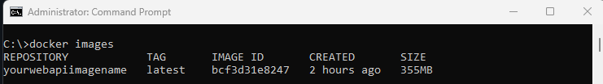

# Blazor WASM + JWT Web API => Docker

A **step-by-step guide** on how to **containerize** a **Blazor WebAssembly** and a **.NET Web API with JWT Authentication**.

At the moment of this writing, I was working on a project where a **.NET Web API** was consumed by a **Blazor WebAssembly** application.

The API is protected by **Json Web Tokens authentication (JWT)** and both the **Blazor WASM app** as the **.NET Web API** had a reference on the same **Shared Class Library**.

In the accompanying **GitHub Repo** you find a **.NET Web API protected by JWT authentication** where the API is consumed by a **Blazor WebAssembly application**.

To focus on the **Containerization of the project** and to keep things simple **only the Register and Login functionality** are implemented. 

## Goal

**Dockerize** the complete project, so that project owners could always see the latest status of their project, 
by just entering a few commands via the terminal. 

This journey was more difficult than I expected and that's why I decided to write an article about it—to organize my thoughts and provide a reference for others who may encounter the same problems.

## Requirements

- Windows 11
- .NET 9.0 SDK
- Docker Desktop
- Git

## Docker

### What is Docker?

Docker is a platform for developing, shipping, and running applications inside lightweight, portable containers.
These containers can be started in seconds.

### Docker Image

To run a Docker Container you first need to create a **Docker Image**. 

You create a **Docker Image** using a Dockerfile. A **Dockerfile** is a file with the **step-by-step instructions** on how to create a **Docker Image** of your application.

You can store your Docker Images in an Image Repository, like **Docker Hub** and share them with other people.

### Docker Container

When you run a Docker Image a **Docker Container** is created. 

A **Docker container** is a lightweight, standalone, and executable package,
that includes everything needed (application code, runtime, libraries and dependencies) to run an application. 

## Step-by-step

### Step 1: Create a Docker Image for the .NET Web API

Open your code editor and add a Dockerfile to the Web API project. 
I used JetBrains Rider to add the Dockerfile and this is the file that got created.  

```dockerfile
FROM mcr.microsoft.com/dotnet/aspnet:9.0 AS base
USER $APP_UID
WORKDIR /app
EXPOSE 8080
EXPOSE 8081

FROM mcr.microsoft.com/dotnet/sdk:9.0 AS build
ARG BUILD_CONFIGURATION=Release
WORKDIR /src
COPY ["DotNet.JwtWebApi/DotNet.JwtWebApi.csproj", "DotNet.JwtWebApi/"]
COPY ["DotNet.Shared/DotNet.Shared.csproj", "DotNet.Shared/"]
RUN dotnet restore "DotNet.JwtWebApi/DotNet.JwtWebApi.csproj"
COPY . .
WORKDIR "/src/DotNet.JwtWebApi"
RUN dotnet build "DotNet.JwtWebApi.csproj" -c $BUILD_CONFIGURATION -o /app/build

FROM build AS publish
ARG BUILD_CONFIGURATION=Release
RUN dotnet publish "DotNet.JwtWebApi.csproj" -c $BUILD_CONFIGURATION -o /app/publish /p:UseAppHost=false

FROM base AS final
WORKDIR /app
COPY --from=publish /app/publish .
ENTRYPOINT ["dotnet", "DotNet.JwtWebApi.dll"]

```

After your Dockerfile is created you want to build the Docker Image.
Open a Terminal in the root of the Web API project and run the command below.

```bash
docker build -t imagename-webapi:latest .
```

#### PROBLEM1: COPY failed DotNet.JwtWebApi.csproj: not found

ERROR: failed to solve: failed to compute cache key: failed to calculate checksum of ref xzebf1n4v07hubsvxjhnei0p5::ueacb5w3fxctxf1m7dumbzbyf: 
"/DotNet.JwtWebApi/DotNet.JwtWebApi.csproj": not found

As you can see, the DotNet.JwtWebApi.csproj cannot be found. 
This is because of the **docker build command``` where the **final dot** the context specifies.
In this case, the context is the root of the Web API project.

To solve the problem, you would typically remove 'DotNet.JwtWebApi/' from the COPY line.
Although this solves the problem, you will immediately encounter the next error.

Open a Terminal in the root of the Web API project and run the command below.

```bash
docker build -t imagename-webapi:latest .
```

ERROR: failed to solve: failed to compute cache key: failed to calculate checksum of ref xzebf1n4v07hubsvxjhnei0p5::4c6vv3fgpckdz0qvhotx557sf: 
"/DotNet.Shared/DotNet.Shared.csproj": not found

The first problem has been solved, but now the Shared.csproj cannot be found.

This time, removing 'DotNet.JwtWebApi/' at the beginning of the COPY line does not help.

The **Docker context** (the final dot of the docker build command) is at the **Web API root level**.
Whereas the Shared.csproj file is in the root of the DotNet.Shared project and Docker cannot find the file.

I tried to navigate to the correct path location, by using relative paths, but without success.
After googling around to overcome this problem, I ended up with another approach.

#### SOLUTION1: Create a DockerWebApi folder 

The solution I found was to create a DockerWebApi folder in the parent folder of the WebApi project and the Shared project.
Once the DockerWebApi folder is created, copy/past the Dockerfile in this folder. 

Do not forget to re-add "DotNet.JwtWebApi/" again to the COPY line.

Open a Terminal in the parent folder of DockerWebApi and run the Docker build command to create the Image.

```bash
docker build -t imagename-webapi:latest -f DockerWebApi/Dockerfile .
```
This time, the Docker Image got created, and you can see the image in docker.desktop or by running the `docker images` command 



### Step 2: Create the Docker Container for the .NET Web API

We created the Docker Image in the previous step, now it is time to create and start the Docker Container by running the Image.
Open a Terminal and enter the command below:

```bash
docker run imagename-webapi
```

#### PROBLEM2: appsettings.Production.json - FileNotFoundException

After running the command above, an Unhandled FileNotFoundException is thrown.
This is a correct behavior, in the publishing step of the **DockerFile** **BUILD_CONFIGURATION=Release** is specified,
which defaults to the Production environment. In the project directory there is no appsettings.Production.json file

```bash
Unhandled exception. System.IO.FileNotFoundException: The configuration file 'appsettings.Production.json' was not found and is not optional. The expected physical path was '/app/appsettings.Production.json'.
   at Microsoft.Extensions.Configuration.FileConfigurationProvider.Load(Boolean reload)
   at Microsoft.Extensions.Configuration.ConfigurationManager.AddSource(IConfigurationSource source)
   at Microsoft.Extensions.Configuration.ConfigurationManager.Microsoft.Extensions.Configuration.IConfigurationBuilder.Add(IConfigurationSource source)
   at Program.<Main>$(String[] args) in /src/DotNet.JwtWebApi/Program.cs:line 8
```

#### SOLUTION2: 

The solution would be to add an **appsettings.Production.json** file to the **Web API project**.
In this case, the Environment is not the Production environment, and I want to give the Environment another name.
See next step!

### Step 2: Specify Environment Name at Container Start

In Step 1 we created the Docker Image first, we ran the Image and created/started the Docker Container after.
Let's run the Docker Image again and specify the Environment: DockerStatusEnv, 
Open a Terminal in the root of the project and execute the command below:

```bash
docker run --env ASPNETCORE_ENVIRONMENT=DockerStatusEnv imagename-webapi
```
#### PROBLEM3: appsettings.DockerStatusEnv.json - FileNotFoundException

```bash
Unhandled exception. System.IO.FileNotFoundException: The configuration file 'appsettings.DockerStatusEnv.json' was not found and is not optional.
```
#### SOLUTION3: add appsettings.DockerStatusEnv.json file to the Web API project

This is basically the same FileNoFoundException as before, but this is the Exception we actually want. 
We can now tell Docker to use the specific **appsettings.DockerStatusEnv.json** file.
The only thing to do, is to copy/paste the **appsettings.Development.json** and name it **appsettings.DockerStatusEnv.json**

After you copied/paste the file, pen a Terminal and run the `docker run` command below. FileNotFoundException again!  

```bash
docker run --env ASPNETCORE_ENVIRONMENT=DockerStatusEnv imagename-webapi
```
#### PROBLEM4: appsettings.DockerStatusEnv.json - FileNotFoundException

As you can see, Docker can still not find the **appsettings.DockerStatusEnv.json**. 
Although the **appsettings file** is in the **Web API project**, it is **NOT in the Docker Image**

```bash
Unhandled exception. System.IO.FileNotFoundException: The configuration file 'appsettings.
DockerStatusEnv.json' was not found and is not optional. The expected physical path was '/app/appsettings.DockerStatusEnv.json'.
```
#### SOLUTION4: Regenerate the Docker Image

The solution to the above problem, is rather simple. 
Open a Terminal and run the `docker build` command again to generate a new Docker Image

```bash
docker build -t imagename-webapi:latest -f DockerWebApi/Dockerfile .
```

### Step 3: Start Docker Container from the newly created Docker Image 


