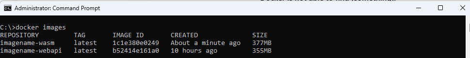
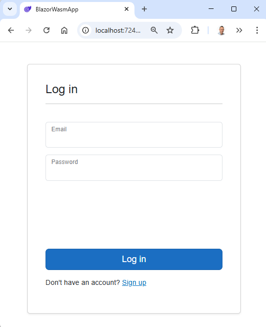

# Blazor WASM + JWT Web API => Docker

A **step-by-step guide** on **containerising** a **Blazor WebAssembly** and a **.NET Web API with JWT Authentication**.

At the time of this writing, I was working on a project where a **.NET Web API** was consumed by a **Blazor WebAssembly** application.

The API is protected by **JSON Web Tokens authentication (JWT)** and both the **Blazor WASM app** and the **.NET Web API** had a reference on the same **Shared Class Library**.

In the accompanying **GitHub Repo**, you find the same setup of a **.NET Web API protected by JWT authentication** where the API is consumed by a **Blazor WebAssembly application**.

To focus on the **Project's Containerization** and to keep things simple **only the Register and Login functionality** are implemented. 

## Goal

**Dockerize** the complete project, so that **project owners can always see the latest status** of the project, 
by just entering a few commands via the Terminal. 

This journey was more difficult than I expected and that's why I decided to write an article about it—**to organize my thoughts and provide a reference for others** who may encounter the same problems.

## Requirements

- Windows 11
- .NET 9.0 SDK
- Docker Desktop
- Git
- Azure subscription (or the possibility to create a Database on a remote SQL Server)
- Postman or Insomnia
- Notepad++

## Docker

### What is Docker?

Docker is a platform for developing, shipping, and running applications inside lightweight, portable containers.
These containers can be started in seconds.

### Docker Image

To run a Docker Container you first need to create a **Docker Image**. 

You create a **Docker Image** using a Dockerfile. A **Dockerfile** is a file with **step-by-step instructions** on how to create a **Docker Image** of your application.

You can store your Docker Images in an Image Repository, like **Docker Hub** and share them with others.

### Docker Container

When you run a Docker Image a **Docker Container** is created. 

A **Docker container** is a lightweight, standalone, and executable package,
that includes everything needed (application code, runtime, libraries and dependencies) to run an application. 

## Containerise .NET Web API

### Step 1: Create a Docker Image for the .NET Web API

Open your code editor and add a Dockerfile to the Web API project.
I used JetBrains Rider to add the Dockerfile, and below is the file that was generated.  

```dockerfile
FROM mcr.microsoft.com/dotnet/aspnet:9.0 AS base
USER $APP_UID
WORKDIR /app
EXPOSE 8080
EXPOSE 8081

FROM mcr.microsoft.com/dotnet/sdk:9.0 AS build
ARG BUILD_CONFIGURATION=Release
WORKDIR /src
COPY ["DotNet.JwtWebApi/DotNet.JwtWebApi.csproj", "DotNet.JwtWebApi/"]
COPY ["DotNet.Shared/DotNet.Shared.csproj", "DotNet.Shared/"]
RUN dotnet restore "DotNet.JwtWebApi/DotNet.JwtWebApi.csproj"
COPY . .
WORKDIR "/src/DotNet.JwtWebApi"
RUN dotnet build "DotNet.JwtWebApi.csproj" -c $BUILD_CONFIGURATION -o /app/build

FROM build AS publish
ARG BUILD_CONFIGURATION=Release
RUN dotnet publish "DotNet.JwtWebApi.csproj" -c $BUILD_CONFIGURATION -o /app/publish /p:UseAppHost=false

FROM base AS final
WORKDIR /app
COPY --from=publish /app/publish .
ENTRYPOINT ["dotnet", "DotNet.JwtWebApi.dll"]

```

After your Dockerfile is created you want to build the Docker Image.
Open a Terminal in the root of the Web API project and run the command below.

```bash
docker build -t imagename-webapi:latest .
```

#### PROBLEM 1: COPY failed DotNet.JwtWebApi.csproj: not found

ERROR: failed to solve: failed to compute cache key: failed to calculate checksum of ref xzebf1n4v07hubsvxjhnei0p5::ueacb5w3fxctxf1m7dumbzbyf: 
"/DotNet.JwtWebApi/DotNet.JwtWebApi.csproj": not found

As you can see, the DotNet.JwtWebApi.csproj cannot be found. 
This is because of the **docker build command** where the **final dot** the context specifies.
In this case, the context is the root of the Web API project.

To solve the problem, you would typically remove 'DotNet.JwtWebApi/' from the COPY line.
Although this solves the problem, you will immediately encounter the next error.

Open a Terminal in the root of the Web API project and run the command below.

```bash
docker build -t imagename-webapi:latest .
```

ERROR: failed to solve: failed to compute cache key: failed to calculate checksum of ref xzebf1n4v07hubsvxjhnei0p5::4c6vv3fgpckdz0qvhotx557sf: 
"/DotNet.Shared/DotNet.Shared.csproj": not found

The first problem has been solved, but now the Shared.csproj cannot be found.

This time, removing 'DotNet.JwtWebApi/' at the beginning of the COPY line does not help.

The **Docker context** (the final dot of the docker build command) is at the **Web API root level**.
Whereas the Shared.csproj file is in the root of the DotNet.Shared project and Docker is not able to find the Shared.csproj file.

I tried to navigate to the correct path location, by using relative paths, absolute paths, etc... but without success.
After searching for solutions, I decided to take a different approach.

#### SOLUTION 1: Create a DockerWebApi folder 

The solution I found was to create a DockerWebApi folder in the parent folder (where the README.md file exists) of the WebApi project.
Once the DockerWebApi folder is created, copy/paste the Dockerfile in this folder. 

Do not forget to re-add "DotNet.JwtWebApi/" again to the COPY line.

Open a Terminal in the parent folder of DockerWebApi and run the Docker build command to create the Image.

```bash
docker build -t imagename-webapi:latest -f DockerWebApi/Dockerfile .
```

This time, the Docker Image was created, and you can see the image in docker.desktop or by running the `docker images` command. 


### Step 2: Create the Docker Container for the .NET Web API

We created the Docker Image in the previous step, now it is time to create and start the Docker Container by running the Image.
Open a Terminal and enter the command below:

```bash
docker run imagename-webapi
```

#### PROBLEM 2: appsettings.Production.json - FileNotFoundException

After running the command above, an Unhandled FileNotFoundException is thrown.
This is a correct behavior, in the publishing step of the **DockerFile** **BUILD_CONFIGURATION=Release** is specified,
which defaults to the Production environment. In the project directory, there is no appsettings.Production.json file.

```bash
Unhandled exception. System.IO.FileNotFoundException: The configuration file 'appsettings.Production.json' was not found and is not optional. The expected physical path was '/app/appsettings.Production.json'.
   at Microsoft.Extensions.Configuration.FileConfigurationProvider.Load(Boolean reload)
   at Microsoft.Extensions.Configuration.ConfigurationManager.AddSource(IConfigurationSource source)
   at Microsoft.Extensions.Configuration.ConfigurationManager.Microsoft.Extensions.Configuration.IConfigurationBuilder.Add(IConfigurationSource source)
   at Program.<Main>$(String[] args) in /src/DotNet.JwtWebApi/Program.cs:line 8
```

#### SOLUTION 2: 

The solution would be to add an **appsettings.Production.json** file to the **Web API project**.
In this case, the Environment is not the Production environment, and I want to give the Environment another name.
See the next step!

### Step 3: Specify Environment Name at Container Start

In Step 1 we created the Docker Image first, ran the Image and created/started the Docker Container after.
Let's run the Docker Image again and specify the Environment: DockerStatusEnv, 
Open a Terminal in the root of the project and execute the command below:

```bash
docker run --env ASPNETCORE_ENVIRONMENT=DockerStatusEnv imagename-webapi
```
#### PROBLEM 3: appsettings.DockerStatusEnv.json - FileNotFoundException

```bash
Unhandled exception. System.IO.FileNotFoundException: The configuration file 'appsettings.DockerStatusEnv.json' was not found and is not optional.
```
#### SOLUTION 3: add appsettings.DockerStatusEnv.json file to the Web API project

This is the same FileNoFoundException as before, but this is the Exception we want. 

We can now tell Docker to use the specific **appsettings.DockerStatusEnv.json** file.
The only thing to do is to copy/paste the **appsettings.Development.json** and name it **appsettings.DockerStatusEnv.json**

After you copy/paste the file, open a Terminal and run the `docker run` command below. FileNotFoundException again!  

```bash
docker run --env ASPNETCORE_ENVIRONMENT=DockerStatusEnv imagename-webapi
```
#### PROBLEM 4: appsettings.DockerStatusEnv.json - FileNotFoundException

As you can see, Docker can still not find the **appsettings.DockerStatusEnv.json**. 
Although the **app settings file** is in the **Web API project**, it is **NOT in the Docker Image**.

```bash
Unhandled exception. System.IO.FileNotFoundException: The configuration file 'appsettings.
DockerStatusEnv.json' was not found and is not optional. The expected physical path was '/app/appsettings.DockerStatusEnv.json'.
```
#### SOLUTION 4: Regenerate the Docker Image

The solution to the above problem is rather simple. 
Open a Terminal and run the `docker build` command again to generate a new Docker Image.

```bash
docker build -t imagename-webapi:latest -f DockerWebApi/Dockerfile .
```

### Step 4: Start the Docker Container from the newly created Docker Image 

We just generated a new Docker Image. Now, it is time to start the Docker Container

```bash
docker run --env ASPNETCORE_ENVIRONMENT=DockerStatusEnv imagename-webapi
```
Finally, The **Web API Docker Container is up and running**. Yet another problem arises.  


#### PROBLEM 5: Container running, but unreachable from the outside world.

Although the Docker Container is running, see image above, you can not reach it by navigating to http://localhost:8080

#### SOLUTION 5: Publishing ports

From the dockerdocs: Publishing a port provides the ability to break through a little bit of networking isolation by setting up a forwarding rule. 
As an example, you can indicate that requests on your host’s port 5000 should be forwarded to the container’s port 8080. 
Publishing ports happens during container creation using the -p (or --publish) flag with docker run. 

The syntax is: `docker run -d -p HOST_PORT:CONTAINER_PORT nginx`

In this case, I would like to use the port **7177** specified in **Properties/launchSettings.json** file of the Web API project.

```bash
docker run -p 7177:8080 --env ASPNETCORE_ENVIRONMENT=DockerStatusEnv imagename-webapi
```
You can reach the **Web API Docker Container** on your local machine by navigating to http://localhost:7177/weatherforecast


### Step 5: Register a User in the running Web API Docker Container

In the step above, we **forwarded the Docker Container Port to a Port on our local machine**, 
and we reached the **WeatherController** in the **Web API Docker Container** and **received Weather Data in JSON format**.

Next, we will try out the **Register a User** by sending a **Register Request** to the Web API Docker Container.
Open **Postman** or **Insomnia```, and make a **Post Request** to the http://localhost:7177/api/account/register url. **Kaboom!**


#### PROBLEM 6: 500 Internal Server Error - LocalDB is not supported on this platform.

```bash
 System.PlatformNotSupportedException: LocalDB is not supported on this platform.
         at Microsoft.Data.SqlClient.SNI.LocalDB.GetLocalDBConnectionString(String localDbInstance)
         at Microsoft.Data.SqlClient.SNI.SNIProxy.GetLocalDBDataSource(String fullServerName, Boolean& error)
         at Microsoft.Data.SqlClient.SNI.SNIProxy.CreateConnectionHandle(String fullServerName, ...
```

When you send the **Register Request** to the **Web API Docker Container** the **RegisterController** is reached.
The code in the controller gets executed, but throws an exception, when trying to insert the newly created user in the Database.

In **Step 3**, we copy/paste the **appsettings.Development.json** and name it **appsettings.DockerStatusEnv.json** but
the **Database Connection string** is still the same and Docker tries to make a connection to your **Local Machine's Database**.

As you can read in the exception message, **LocalDB is not supported on this platform**.
Actually, we don't want docker uses the LocalDB on the Local Machine. We want Docker uses a Sql Server Database on a Remote Machine.

#### SOLUTION 6: Create a remote SQL database in Azure (or somewhere else)

Open the **Azure Portal** and Log in. Click on the **Create Resource** button and Search for **SQL database**.
Click on the **Create SQL database** and follow the instructions to create an **SQL database server** and an **SQL database**. 

**IMPORTANT**: Choose **Use SQL Authentication** when creating the **SQL database server**,
and write down the **Server admin login** and **Password** as you will need them later.

Give the **SQL database** the name: **DotNetDb**.
 
After the SQL database and SQL Server have been created, you need to *Add your client IPv4 address* as a **Firewall rule**
In Azure go to the **SQL database server you created**. In the **Security menu**, click on the **Networking sub menu**. 
In the **Public Access** Tab, enable **Selected networks**. At the **Firewall rules** section, click on the **Add your client IPv4 address (your IP address)** button and click Save.  

Next, Go to the **SQL database**, and click on **Show database Connection strings**. Copy the **ADO SQL Authentication Connection string**  for later use.

### Step 6: Update Connection string in appsettings.Development.json file - Update Database

Temporary change the Connection string in the appsettings.Development.json file to the copied Connection string.
IMPORTANT: **Do not forget to update the Password**.

```bash
Server=tcp:yourservername.database.windows.net,1433;Initial Catalog=DotNetDb;Persist Security Info=False;User ID=yourserveradminlogin;Password=yourpassword;MultipleActiveResultSets=False;Encrypt=True;TrustServerCertificate=False;Connection Timeout=30;
```

Open a **Terminal** at the root of the **DotNet.JwtWebApi project** and run the command below to **update the SQL Database in Azure**.
When the Database update is successful, change the Connection string back to its original value.

```bash
dotnet ef database update
```

#### PROBLEM 7: Microsoft.Data.SqlClient.SqlException (0x80131904): Reason: An instance-specific error occurred while establishing a connection to SQL Server.

You would encounter this exception, when you forgot to **Add your client IPv4 address (your IP address)** in your **SQL Database server**

Microsoft.Data.SqlClient.SqlException (0x80131904): Reason: An instance-specific error occurred while establishing a connection to SQL Server. 
Connection was denied since Deny Public Network Access is set to Yes. ... 

### Step 5: Update Connection string in appsettings.DockerStatusEnv.json file - Register User

Update the **Connection string** in the **appsettings.DockerStatusEnv.json** file.

```bash
Server=tcp:yourservername.database.windows.net,1433;Initial Catalog=DotNetDb;Persist Security Info=False;User ID=yourserveradminlogin;Password=yourpassword;MultipleActiveResultSets=False;Encrypt=True;TrustServerCertificate=False;Connection Timeout=30;
```

The **Connection string** in the **appsettings.DockerStatusEnv.json** file has been updated. 

Yet, we need to apply this change to the Docker Image by creating a new Image. 
Open a Terminal in the root of the project (where the README.md file exists) and run the command below:

```bash
docker build -t imagename-webapi:latest -f DockerWebApi/Dockerfile .
```

After the Docker image has been created, Run the Docker image as a Docker Container by executing this command:

```bash
docker run -p 7177:8080 --env ASPNETCORE_ENVIRONMENT=DockerStatusEnv imagename-webapi
```
#### PROBLEM 8: There is already a Docker Container running on Port 7177

docker: Error response from daemon: 
driver failed programming external connectivity on endpoint gifted_babbage (a2e4ab415d8797edb42c54da23002c37e7224471c1b03add5ffe68fc8a20acfe): 
Bind for 0.0.0.0:7177 failed: port is already allocated.

#### SOLUTION 8: Stop the running Container

Open a Terminal and run `docker ps` to see all the running containers.


To stop a running container, use the **docker stop** command and provide the container ID, in this case

```bash
docker stop cc38db1cccc9
```

The old running container is stopped, execute the command below to run the new docker container 

```bash
docker run -p 7177:8080 --env ASPNETCORE_ENVIRONMENT=DockerStatusEnv imagename-webapi
```

### Step 7: Register a User in the running Web API Docker Container

In the step above, we created and updated a remote SQL Database in Azure. 
And, we generated a new Docker Image and the new Docker Container is running on http://localhost:7177/weatherforecast 

We can reach the **WeatherController** in the **Web API Docker Container** because we **receive Weather Data in JSON format**.

Next, we will try out the **Register a User** by sending a **Register Request** to the Web API Docker Container.
Open **Postman** or **Insomnia```, and make a **Post Request** to the http://localhost:7177/api/account/register url. 


Finally, the hard work pays off! We successfully registered a user in our running Docker Container.  

### Step 8: Test User Login and obtain Access and Refresh token

Open **Postman** or **Insomnia```, and make a **Post Request** to the http://localhost:7177/api/account/login url.


The Login functionality works like expected, and we receive the Access- and Refresh token needed for accessing the JWT protected Web API.

## Containerise a Blazor WebAssembly application 

The API is up and running. Now it's time to containerise the Blazor WebAssembly application

### Step 1: Create a Docker Image for the Blazor WebAssembly application

Open your code editor and add a Dockerfile to the Blazor WebAssembly project.
I used JetBrains Rider to add the Dockerfile, and below is the file that was generated.

```dockerfile
FROM mcr.microsoft.com/dotnet/aspnet:9.0 AS base
USER $APP_UID
WORKDIR /app
EXPOSE 8080
EXPOSE 8081

FROM mcr.microsoft.com/dotnet/sdk:9.0 AS build
ARG BUILD_CONFIGURATION=Release
WORKDIR /src
COPY ["DotNet.BlazorWasmApp/DotNet.BlazorWasmApp.csproj", "DotNet.BlazorWasmApp/"]
COPY ["DotNet.Shared/DotNet.Shared.csproj", "DotNet.Shared/"]
RUN dotnet restore "DotNet.BlazorWasmApp/DotNet.BlazorWasmApp.csproj"
COPY . .
WORKDIR "/src/DotNet.BlazorWasmApp"
RUN dotnet build "DotNet.BlazorWasmApp.csproj" -c $BUILD_CONFIGURATION -o /app/build

FROM build AS publish
ARG BUILD_CONFIGURATION=Release
RUN dotnet publish "DotNet.BlazorWasmApp.csproj" -c $BUILD_CONFIGURATION -o /app/publish /p:UseAppHost=false

FROM base AS final
WORKDIR /app
COPY --from=publish /app/publish .
ENTRYPOINT ["dotnet", "DotNet.BlazorWasmApp.dll"]
```

After your Dockerfile is created you want to build the Docker Image.
Open a Terminal in the root of the Blazor Web Assembly project and run the command below.

```bash
docker build -t imagename-wasm:latest .
```

#### PROBLEM 9: COPY failed DotNet.Shared.csproj: not found

ERROR: failed to solve: failed to compute cache key: failed to calculate checksum of ref xzebf1n4v07hubsvxjhnei0p5::iw3202cg2dqjiyey8q031dz9t: 
"/DotNet.Shared/DotNet.Shared.csproj": not found

As you can see, the DotNet.Shared.csproj cannot be found.
This is because of the **docker build command** where the **final dot** the context specifies.
In this case, the context is the root of the BlazorWasmApp project.

To solve the problem, you would typically remove 'DotNet.BlazorWasmApp/' from the COPY line.
Although this solves the problem, you will immediately encounter the next error.

Open a Terminal in the root of the BlazorWasmApp project and run the command below.

```bash
docker build -t imagename-wasm:latest .
```

ERROR: failed to solve: failed to compute cache key: failed to calculate checksum of ref xzebf1n4v07hubsvxjhnei0p5::4c6vv3fgpckdz0qvhotx557sf:
"/DotNet.Shared/DotNet.Shared.csproj": not found

The first problem has been solved, but now the Shared.csproj cannot be found.

This time, removing 'DotNet.BlazorWasmApp/' at the beginning of the COPY line does not help.

The **Docker context** (the final dot of the docker build command) is at the **Blazor WebAssembly root level**.
Whereas the Shared.csproj file is in the root of the DotNet.Shared project and Docker is not able to find the Shared.csproj file.

I tried to navigate to the correct path location, by using relative paths, absolute paths, etc... but without success.
After searching for solutions, I decided to take a different approach.

#### SOLUTION 1: Create a DockerWasm folder

The solution I found was to create a DockerWasm folder in the parent folder (where the README.md file exists) of the Blazor WebAssembly project.
Once the DockerWasm folder is created, copy/paste the Dockerfile in this folder.

Do not forget to re-add "DotNet.BlazorWasmApp/" again to the COPY line.

Open a Terminal in the parent folder of DockerWasm folder and run the Docker build command to create the Image.

```bash
docker build -t imagename-wasm:latest -f DockerWasm/Dockerfile .
```

This time, the Docker Image was created, and you can see the image in docker.desktop or by running the `docker images` command.



### Step 2: Create the Docker Container for the Blazor WebAssembly application

We created the Docker Image in the previous step, now it is time to create and start the Docker Container by running the Image.
Open a Terminal and enter the command below:

```bash
docker run imagename-wasm
```

#### PROBLEM 10: The command could not be loaded, possibly because:

After running the command above, this message with 2 possible reasons is shown in the terminal.
We can exclude the last one, because we would have had this problem before, when running the Web API container. 

Why is Docker showing the message: "The application 'DotNet.BlazorWasmApp.dll' does not exist"?

```bash
C:\>docker run imagename-wasm
The command could not be loaded, possibly because:
  * You intended to execute a .NET application:
      The application 'DotNet.BlazorWasmApp.dll' does not exist.
  * You intended to execute a .NET SDK command:
      No .NET SDKs were found.

Download a .NET SDK:
https://aka.ms/dotnet/download

Learn about SDK resolution:
https://aka.ms/dotnet/sdk-not-found
```

#### SOLUTION 10:

Blazor WebAssembly produce static files when published and there is no need of the ASP.NET Core runtime to serve these files.
Instead of the ASP.NET Core runtime Docker image as the base for the final image, we need another final image to serve our files?  

NGINX to the rescue!

NGINX is a free and open-source web server that can be used to serve static content and, there is also a Docker image available.

Update the Dockerfile in the DockerWasm folder, like the file below

```dockerfile
FROM nginx AS nginxbase

FROM mcr.microsoft.com/dotnet/aspnet:9.0 AS base
USER $APP_UID
WORKDIR /app
EXPOSE 8080
EXPOSE 8081

FROM mcr.microsoft.com/dotnet/sdk:9.0 AS build
ARG BUILD_CONFIGURATION=Release
WORKDIR /src

COPY ["DotNet.BlazorWasmApp/DotNet.BlazorWasmApp.csproj", "DotNet.BlazorWasmApp/"]
COPY ["DotNet.Shared/DotNet.Shared.csproj", "DotNet.Shared/"]

RUN dotnet restore "DotNet.Shared/DotNet.Shared.csproj"
RUN dotnet restore "DotNet.BlazorWasmApp/DotNet.BlazorWasmApp.csproj"
COPY . .

WORKDIR "/src/DotNet.BlazorWasmApp"
RUN dotnet build "DotNet.BlazorWasmApp.csproj" -c $BUILD_CONFIGURATION -o /app/build

FROM build AS publish
ARG BUILD_CONFIGURATION=Release
RUN dotnet publish "DotNet.BlazorWasmApp.csproj" -c $BUILD_CONFIGURATION -o /app/publish /p:UseAppHost=false

RUN ls --recursive /src/DotNet.BlazorWasmApp/

FROM  nginxbase AS final
WORKDIR /usr/share/nginx/html
COPY --from=publish /app/publish/wwwroot .
COPY  DotNet.BlazorWasmApp/nginx.conf /etc/nginx/nginx.conf
```

Because we have changed the Dockerfile, we now have to rebuild the Docker Image.

Open a Terminal in the parent folder of DockerWasm folder and run the Docker build command to create the Image.

```bash
docker build -t imagename-wasm:latest -f DockerWasm/Dockerfile .
```
#### PROBLEM 11: file "/DotNet.BlazorWasmApp/nginx.conf": not found

```bash
ERROR: failed to solve: failed to compute cache key: failed to calculate checksum of ref xzebf1n4v07hubsvxjhnei0p5::jzwwhgfipwbhnm3khwghbk1zh: 
"/DotNet.BlazorWasmApp/nginx.conf": not found
```

#### SOLUTION 11: Add a nginx.conf file to the DotNet.BlazorWasmApp folder

Add a nginx.conf file with the content below to the DotNet.BlazorWasmApp folder.

```nginx configuration
events{}
http{
    include /etc/nginx/mime.types;
    server {
        listen 80;
        server_name localhost;
        root /usr/share/nginx/html;
        index index.html;
        location / {
            try_files $uri $uri/ /index.html;
        }
    }
}
```

Open a Terminal in the parent folder of DockerWasm folder and run the Docker build command to create the Image.

```bash
docker build -t imagename-wasm:latest -f DockerWasm/Dockerfile .
```

After the Image has been created, start a Docker Container by executing the command below:

```bash
docker run -p 7248:80 imagename-wasm 
```

#### PROBLEM 12: nginx: unknown directive "events" in /etc/nginx/nginx.conf:1

This error message is a bit confusing, because the content of the file is correct.
The problem has something to do with the encoding of the file. In my case, the encoding was UTF-8.

#### SOLUTION 12:
Open the nginx.conf file in Notepad++ and change its encoding to ANSI.

After you changed the encoding run the Docker build command again to create the Image.

```bash
docker build -t imagename-wasm:latest -f DockerWasm/Dockerfile .
```

After the Image has been created, start a Docker Container by executing the command below:

```bash
docker run -p 7248:80 imagename-wasm 
```

Open a browser and navigate to the http://localhost:7248/account/login url.




This means we don't need to use the ASP.NET Core runtime Docker image as the base for our final image. So, how are we going to serve our files? The solution is to use NGINX.


This is a correct behavior, in the publishing step of the **DockerFile** **BUILD_CONFIGURATION=Release** is specified,
which defaults to the Production environment. In the project directory, there is no appsettings.Production.json file.

```bash
Unhandled exception. System.IO.FileNotFoundException: The configuration file 'appsettings.Production.json' was not found and is not optional. The expected physical path was '/app/appsettings.Production.json'.
   at Microsoft.Extensions.Configuration.FileConfigurationProvider.Load(Boolean reload)
   at Microsoft.Extensions.Configuration.ConfigurationManager.AddSource(IConfigurationSource source)
   at Microsoft.Extensions.Configuration.ConfigurationManager.Microsoft.Extensions.Configuration.IConfigurationBuilder.Add(IConfigurationSource source)
   at Program.<Main>$(String[] args) in /src/DotNet.BlazorWasmApp/Program.cs:line 8
```

#### SOLUTION 10:

The solution would be to add an **appsettings.Production.json** file to the **BlazorWasmApp project**.
In this case, the Environment is not the Production environment, and I want to give the Environment another name.
See the next step!

### Step 3: Specify Environment Name at Container Start

In Step 1 we created the Docker Image first, ran the Image and created/started the Docker Container after.
Let's run the Docker Image again and specify the Environment: DockerStatusEnv,
Open a Terminal in the root of the project and execute the command below:

```bash
docker run --env ASPNETCORE_ENVIRONMENT=DockerStatusEnv imagename-webapi
```
#### PROBLEM 3: appsettings.DockerStatusEnv.json - FileNotFoundException

```bash
Unhandled exception. System.IO.FileNotFoundException: The configuration file 'appsettings.DockerStatusEnv.json' was not found and is not optional.
```
#### SOLUTION 3: add appsettings.DockerStatusEnv.json file to the BlazorWasmApp project

This is the same FileNoFoundException as before, but this is the Exception we want.

We can now tell Docker to use the specific **appsettings.DockerStatusEnv.json** file.
The only thing to do is to copy/paste the **appsettings.Development.json** and name it **appsettings.DockerStatusEnv.json**

After you copy/paste the file, open a Terminal and run the `docker run` command below. FileNotFoundException again!

```bash
docker run --env ASPNETCORE_ENVIRONMENT=DockerStatusEnv imagename-webapi
```
#### PROBLEM 4: appsettings.DockerStatusEnv.json - FileNotFoundException

As you can see, Docker can still not find the **appsettings.DockerStatusEnv.json**.
Although the **app settings file** is in the **BlazorWasmApp project**, it is **NOT in the Docker Image**.

```bash
Unhandled exception. System.IO.FileNotFoundException: The configuration file 'appsettings.
DockerStatusEnv.json' was not found and is not optional. The expected physical path was '/app/appsettings.DockerStatusEnv.json'.
```
#### SOLUTION 4: Regenerate the Docker Image

The solution to the above problem is rather simple.
Open a Terminal and run the `docker build` command again to generate a new Docker Image.

```bash
docker build -t imagename-wasm:latest -f DockerWasm/Dockerfile .
```

### Step 4: Start the Docker Container from the newly created Docker Image

We just generated a new Docker Image. Now, it is time to start the Docker Container

```bash
docker run --env ASPNETCORE_ENVIRONMENT=DockerStatusEnv imagename-webapi
```
Finally, The **BlazorWasmApp Docker Container is up and running**. Yet another problem arises.


#### PROBLEM 5: Container running, but unreachable from the outside world.

Although the Docker Container is running, see image above, you can not reach it by navigating to http://localhost:8080

#### SOLUTION 5: Publishing ports

From the dockerdocs: Publishing a port provides the ability to break through a little bit of networking isolation by setting up a forwarding rule.
As an example, you can indicate that requests on your host’s port 5000 should be forwarded to the container’s port 8080.
Publishing ports happens during container creation using the -p (or --publish) flag with docker run.

The syntax is: `docker run -d -p HOST_PORT:CONTAINER_PORT nginx`

In this case, I would like to use the port **7177** specified in **Properties/launchSettings.json** file of the BlazorWasmApp project.

```bash
docker run -p 7177:8080 --env ASPNETCORE_ENVIRONMENT=DockerStatusEnv imagename-webapi
```
You can reach the **BlazorWasmApp Docker Container** on your local machine by navigating to http://localhost:7177/weatherforecast


### Step 5: Register a User in the running BlazorWasmApp Docker Container

In the step above, we **forwarded the Docker Container Port to a Port on our local machine**,
and we reached the **WeatherController** in the **BlazorWasmApp Docker Container** and **received Weather Data in JSON format**.

Next, we will try out the **Register a User** by sending a **Register Request** to the BlazorWasmApp Docker Container.
Open **Postman** or **Insomnia```, and make a **Post Request** to the http://localhost:7177/api/account/register url. **Kaboom!**


#### PROBLEM 6: 500 Internal Server Error - LocalDB is not supported on this platform.

```bash
 System.PlatformNotSupportedException: LocalDB is not supported on this platform.
         at Microsoft.Data.SqlClient.SNI.LocalDB.GetLocalDBConnectionString(String localDbInstance)
         at Microsoft.Data.SqlClient.SNI.SNIProxy.GetLocalDBDataSource(String fullServerName, Boolean& error)
         at Microsoft.Data.SqlClient.SNI.SNIProxy.CreateConnectionHandle(String fullServerName, ...
```

When you send the **Register Request** to the **BlazorWasmApp Docker Container** the **RegisterController** is reached.
The code in the controller gets executed, but throws an exception, when trying to insert the newly created user in the Database.

In **Step 3**, we copy/paste the **appsettings.Development.json** and name it **appsettings.DockerStatusEnv.json** but
the **Database Connection string** is still the same and Docker tries to make a connection to your **Local Machine's Database**.

As you can read in the exception message, **LocalDB is not supported on this platform**.
Actually, we don't want docker uses the LocalDB on the Local Machine. We want Docker uses a Sql Server Database on a Remote Machine.

#### SOLUTION 6: Create a remote SQL database in Azure (or somewhere else)

Open the **Azure Portal** and Log in. Click on the **Create Resource** button and Search for **SQL database**.
Click on the **Create SQL database** and follow the instructions to create an **SQL database server** and an **SQL database**.

**IMPORTANT**: Choose **Use SQL Authentication** when creating the **SQL database server**,
and write down the **Server admin login** and **Password** as you will need them later.

Give the **SQL database** the name: **DotNetDb**.

After the SQL database and SQL Server have been created, you need to *Add your client IPv4 address* as a **Firewall rule**
In Azure go to the **SQL database server you created**. In the **Security menu**, click on the **Networking sub menu**.
In the **Public Access** Tab, enable **Selected networks**. At the **Firewall rules** section, click on the **Add your client IPv4 address (your IP address)** button and click Save.

Next, Go to the **SQL database**, and click on **Show database Connection strings**. Copy the **ADO SQL Authentication Connection string**  for later use.

### Step 6: Update Connection string in appsettings.Development.json file - Update Database

Temporary change the Connection string in the appsettings.Development.json file to the copied Connection string.
IMPORTANT: **Do not forget to update the Password**.

```bash
Server=tcp:yourservername.database.windows.net,1433;Initial Catalog=DotNetDb;Persist Security Info=False;User ID=yourserveradminlogin;Password=yourpassword;MultipleActiveResultSets=False;Encrypt=True;TrustServerCertificate=False;Connection Timeout=30;
```

Open a **Terminal** at the root of the **DotNet.BlazorWasmApp project** and run the command below to **update the SQL Database in Azure**.
When the Database update is successful, change the Connection string back to its original value.

```bash
dotnet ef database update
```

#### PROBLEM 7: Microsoft.Data.SqlClient.SqlException (0x80131904): Reason: An instance-specific error occurred while establishing a connection to SQL Server.

You would encounter this exception, when you forgot to **Add your client IPv4 address (your IP address)** in your **SQL Database server**

Microsoft.Data.SqlClient.SqlException (0x80131904): Reason: An instance-specific error occurred while establishing a connection to SQL Server.
Connection was denied since Deny Public Network Access is set to Yes. ...

### Step 5: Update Connection string in appsettings.DockerStatusEnv.json file - Register User

Update the **Connection string** in the **appsettings.DockerStatusEnv.json** file.

```bash
Server=tcp:yourservername.database.windows.net,1433;Initial Catalog=DotNetDb;Persist Security Info=False;User ID=yourserveradminlogin;Password=yourpassword;MultipleActiveResultSets=False;Encrypt=True;TrustServerCertificate=False;Connection Timeout=30;
```

The **Connection string** in the **appsettings.DockerStatusEnv.json** file has been updated.

Yet, we need to apply this change to the Docker Image by creating a new Image.
Open a Terminal in the root of the project (where the README.md file exists) and run the command below:

```bash
docker build -t imagename-wasm:latest -f DockerWasm/Dockerfile .
```

After the Docker image has been created, Run the Docker image as a Docker Container by executing this command:

```bash
docker run -p 7177:8080 --env ASPNETCORE_ENVIRONMENT=DockerStatusEnv imagename-webapi
```
#### PROBLEM 8: There is already a Docker Container running on Port 7177

docker: Error response from daemon:
driver failed programming external connectivity on endpoint gifted_babbage (a2e4ab415d8797edb42c54da23002c37e7224471c1b03add5ffe68fc8a20acfe):
Bind for 0.0.0.0:7177 failed: port is already allocated.

#### SOLUTION 8: Stop the running Container

Open a Terminal and run `docker ps` to see all the running containers.


To stop a running container, use the **docker stop** command and provide the container ID, in this case

```bash
docker stop cc38db1cccc9
```

The old running container is stopped, execute the command below to run the new docker container

```bash
docker run -p 7177:8080 --env ASPNETCORE_ENVIRONMENT=DockerStatusEnv imagename-webapi
```

### Step 7: Register a User in the running BlazorWasmApp Docker Container

In the step above, we created and updated a remote SQL Database in Azure.
And, we generated a new Docker Image and the new Docker Container is running on http://localhost:7177/weatherforecast

We can reach the **WeatherController** in the **BlazorWasmApp Docker Container** because we **receive Weather Data in JSON format**.

Next, we will try out the **Register a User** by sending a **Register Request** to the BlazorWasmApp Docker Container.
Open **Postman** or **Insomnia```, and make a **Post Request** to the http://localhost:7177/api/account/register url.


Finally, the hard work pays off! We successfully registered a user in our running Docker Container.

### Step 8: Test User Login and obtain Access and Refresh token

Open **Postman** or **Insomnia```, and make a **Post Request** to the http://localhost:7177/api/account/login url.


The Login functionality works like expected, and we receive the Access- and Refresh token needed for accessing the JWT protected BlazorWasmApp.
Now, it's time to do the same, but this time for the front-end Blazor WebAssembly application.


